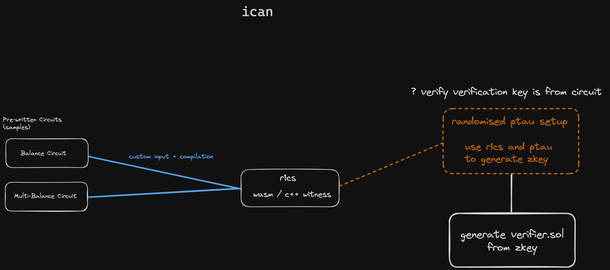

# ican
ican is a zk (zero-knowledge) permissionless proving system that allows users to prove they are capbable of 'x' without doxxing themselves. The system utilizes zero-knowledge proofs to ensure privacy and security.

## Overview
The workflow of ican is outlined in the diagram below:

## Workflow Explanation
- Pre-written Circuits (Samples):
    - Balance Circuit
    - Multi-Balance Circuit  
These circuits are used as the base for generating proofs. Users can provide custom input and compile these circuits.

- R1CS (Rank-1 Constraint System):
The circuits are compiled to R1CS using either wasm or C++ witness generators.
- Randomized PTAU Setup:
A random PTAU (Powers of Tau) setup is used.
The R1CS and PTAU are utilized to generate a ZKey (Zero-Knowledge Key).
- Verifier Generation:
The generated ZKey is used to create a verifier.sol smart contract.
The verification key is verified to ensure it is derived from the circuit.
- Verifier is deployed and verified on [Starknet](https://www.starknet.io/).

## Contributing
Contributions are welcome! Please submit a pull request or open an issue to discuss any changes.

## License
This project is licensed under the [MIT License](https://opensource.org/licenses/MIT).